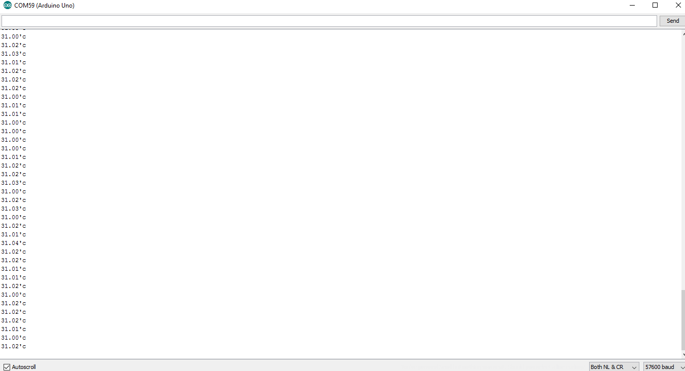

# ProtoCentral MAX30205 Human Body Temperature Sensor Breakout Board

If you don't already have one, you can buy the ProtoCentral FDC1004 breakout board from:

* [ProtoCentral(Worldwide)](https://www.protocentral.com/open-source-health/1088-protocentral-max30205-body-temperature-sensor-breakout-board.html)

* [ProtoCentral USA](https://protocentral.us/products/4-protocentral-max30205-body-temperature-sensor-breakout-board.html)

MAX30205 is the new chip from Maxim which provides accurate human body temperature readings with an accuracy of 0.1 °C

This is a digital I2C temperature sensor, so an ADC would not be required to read this sensor. It also provide an over-temperature alarm as an interrupt to drive micro controller interrupt lines.

## Features

* High Accuracy: 0.1 °C over a range of 37°C to 39°C
* Temperature Resolution: 16-bit (0.00390625°C)
* Digital I2C 2-wire interface
* "OS" open-drain pin can act as thermostat control

## Connecting the breakout to an Arduino

Wire the MAX30205 breakout board to an Arduino Uno(or equivalent) using the following connections.

| Arduino | MAX30205 Breakout board
| ------- |  -------------
| 5v      |    Vin (3.3V is also supported, change solder jumper behind the board. Default will be 5V)
| GND     |  GND
| A4      |  SDA
| A5      |  SCL

###  Uploading Arduino Sketch For MAX30205 breakout

1.  Open the Arduino IDE to load the embedded code for Protocentral_MAX30205.
2.  Click on File -> Open and Browse the .ino code for Arduino from Protocentral_MAX30205-master\arduino and export the application to Arduino.
3. Open serial terminal window, you should see the temperature values obtained from the Protocentral_MAX30205 Breakout Board as shown below.

# License Information

This product is open source! Both, our hardware and software are open source and licensed under the following licenses:

## Hardware
**All hardware is released under [Creative Commons Share-alike 4.0 International](http://creativecommons.org/licenses/by-sa/4.0/).**

## Software
**All software is released under the MIT License(http://opensource.org/licenses/MIT).**

Please check [*LICENSE.md*](LICENSE.md) for detailed license descriptions.
