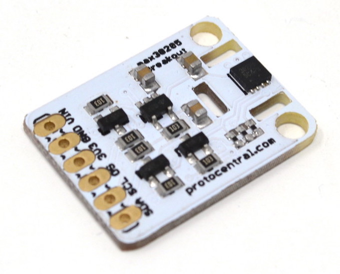
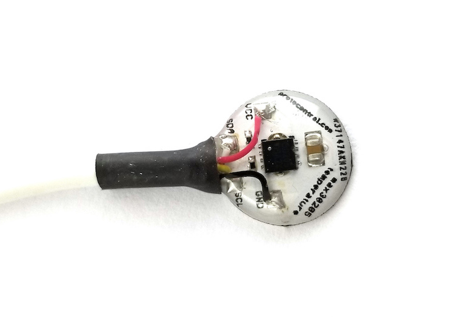
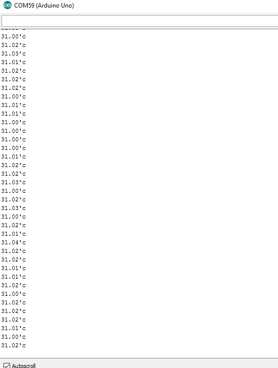

# Protocentral MAX30205 Body Temperature Sensor Library

[](https://github.com/Protocentral/Protocentral_MAX30205/actions?workflow=Compile+Examples)

Arduino library for the Protocentral MAX30205 human body temperature sensor breakout board.

## Don't have one? [Buy it here](https://protocentral.com/product/protocentral-max30205-body-temperature-sensor-breakout-board/)

You can buy the Qwiic-compatible MAX30205 [here](https://protocentral.com/product/protocentral-max30205-wearable-body-thermometer-breakout-board-qwiic-compatible/).




The QWIIC-compatible ProtoCentral MAX30205 breakout board is a wearable human body temperature sensor that reads with an accuracy of +/-0.1 °C. This is a digital I2C-based sensor, so no external ADC is required.

This version of the board is round and designed to be directly wearable by exposing an aluminium surface. The aluminium-base PCB helps in easy thermal conduction so that most of the heat gets transferred to the sensor, resulting in more accurate readings. The top side of the PCB is encapsulated in clear epoxy resin to make it waterproof, and it uses a medical-grade, biocompatible, flexible cable that does not irritate the skin.

## Features

- Digital I2C body temperature sensor — no external ADC needed
- High accuracy of +/-0.1 °C over the 37 °C to 39 °C range
- 16-bit resolution (1 LSB = 0.00390625 °C)
- Reads temperature in Celsius or Fahrenheit
- Automatic address scanning (0x48 / 0x49)
- Low-power shutdown mode (<3.5 µA)
- Works on any board with `Wire` (AVR, SAMD, ESP32, ESP8266, RP2040, STM32, and more)

## Installation

### Arduino Library Manager (Recommended)
1. Open the Arduino IDE
2. Go to **Sketch → Include Library → Manage Libraries**
3. Search for "Protocentral MAX30205"
4. Click **Install**

### Manual Installation
1. Download or clone this repository
2. Copy it into your Arduino libraries folder (`~/Documents/Arduino/libraries/`)

## Hardware Setup

Connect the breakout board to the Arduino as follows:

| MAX30205 pin | Arduino connection | Pin function |
|--------------|--------------------|--------------|
| Vin / 5V | Vin (3.3V also supported, change the solder jumper on the back; default is 5V) | Power supply |
| GND | GND | Ground |
| SDA | A4 (or the board's SDA pin) | Serial data |
| SCL | A5 (or the board's SCL pin) | Serial clock |

## Quick Start

```cpp
#include <Wire.h>
#include "Protocentral_MAX30205.h"

MAX30205 tempSensor;

void setup() {
  Serial.begin(115200);
  Wire.begin();

  // Scan for the sensor at 0x48 / 0x49 until one is found
  while (!tempSensor.scanAvailableSensors()) {
    Serial.println("Couldn't find the temperature sensor, please connect the sensor.");
    delay(5000);
  }

  tempSensor.begin();   // Continuous conversion, active mode
}

void loop() {
  Serial.print(tempSensor.getTemperature(), 2);
  Serial.println(" C");
  delay(100);
}
```

### Using a custom I2C bus or address

The constructor accepts an explicit I2C address and `TwoWire` instance:

```cpp
MAX30205 tempSensor(MAX30205_ADDRESS2, Wire1);   // 0x48 on the Wire1 bus
```

## API Reference

### Constructor

```cpp
MAX30205(uint8_t sensorAddress = MAX30205_ADDRESS1, TwoWire &wirePort = Wire)
```

### Methods

| Method | Description |
|--------|-------------|
| `begin()` | Configure continuous conversion mode; returns `true` if the sensor responds |
| `scanAvailableSensors()` | Probe addresses 0x48 and 0x49, latch the one that responds; returns `true` if found |
| `getTemperature()` | Read the body temperature in degrees Celsius |
| `getTemperatureF()` | Read the body temperature in degrees Fahrenheit |
| `shutdown()` | Put the device into low-power shutdown mode |
| `printRegisters()` | Dump the register contents to `Serial` for debugging |

### Constants

| Constant | Value | Description |
|----------|-------|-------------|
| `MAX30205_ADDRESS1` | `0x49` | Default I2C address |
| `MAX30205_ADDRESS2` | `0x48` | Alternate I2C address |
| `MAX30205_RESOLUTION` | `0.00390625` | Degrees Celsius per LSB |

## Examples

| Example | Description |
|---------|-------------|
| `01-basic-temperature-reading` | Print temperature in Celsius and Fahrenheit to the Serial Monitor |
| `02-temperature-serial-plotter` | Stream temperature to the Arduino Serial Plotter |

## Visualizing Output

Open the Arduino Serial Monitor (or Serial Plotter) at 115200 baud to view the readings.



## Documentation

For further details, refer to [the documentation on the MAX30205 breakout board](https://docs.protocentral.com/getting-started-with-MAX30205/).

## License


This product is open source! Both our hardware and software are open source and licensed under the following licenses:

**Hardware:** [Creative Commons Share-alike 4.0 International](http://creativecommons.org/licenses/by-sa/4.0/) 

**Software:** [MIT License](http://opensource.org/licenses/MIT)

**Documentation:** [Creative Commons Share-alike 4.0 International](http://creativecommons.org/licenses/by-sa/4.0/)

See [LICENSE.md](LICENSE.md) for the full license text.
